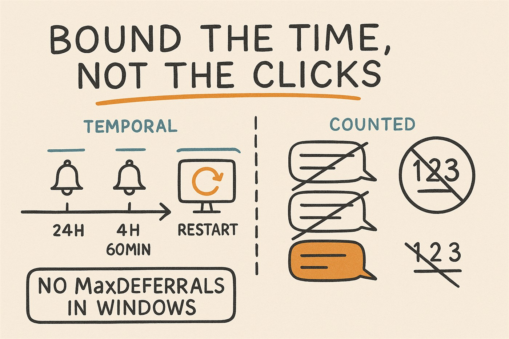

# Windows restart experience, with Intune



**There is no `MaxDeferrals` in Windows.**

Not in Intune, not in Windows Autopatch, not in the Update CSP. Windows enforcement is
*temporal* — a deadline, a grace period, a notification schedule. It is never a *count* of
user actions.

So when a business requirement arrives worded as *"the user must be able to refuse exactly
twice, and the third prompt forces the restart"*, you are not looking for a setting you have
not found yet. You are looking at a software development project: a service to write, sign,
distribute, supervise and maintain against every future Windows build.

This repository holds what we built once we established that, and the evidence tooling that
proves it landed on the device.

---

## ⚠️ Correction — the notification layer is legacy on Windows 11

**Raised by [James Robinson](https://learn.microsoft.com/en-us/windows/client-management/mdm/policy-csp-update#autorestartrequirednotificationdismissal), Intune & Windows MVP, after the first publication of this repository. He was right, and the problem is wider than the setting he named.**

All **five** settings of the "enriched native baseline" below sit in the **Legacy Policies**
section of the Update CSP, each carrying the same note:

> *This is a legacy policy and isn't applicable for Windows 11. Legacy policies might be
> removed in a future release.* — Applicable OS: **Windows 10, version 1703 and later.**

`AutoRestartRequiredNotificationDismissal` · `ScheduleRestartWarning` ·
`ScheduleImminentRestartWarning` · `SetAutoRestartNotificationDisable` ·
`AutoRestartNotificationSchedule`

**So the T−24h / T−4h / T−60min escalation has no supported basis on Windows 11.** Treat
`policies/update-notifications.json` as **Windows 10 only**. It is kept here for the record
and for Windows 10 estates, not as a recommendation for Windows 11.

**What is unaffected**, and remains the substance of this repository:

| Still supported on Windows 11 | Where |
|---|---|
| `ConfigureDeadlineForFeatureUpdates` | `policies/update-ring.json` |
| `ConfigureDeadlineGracePeriodForFeatureUpdates` — explicitly lists Windows 11 21H2+ | `policies/update-ring.json` |
| No auto-reboot before the deadline | `policies/update-ring.json` |
| The whole evidence collector | `tools/Get-UpdateEvidence.ps1` |

The deadline-plus-grace model is not legacy and is what the update ring actually configures.
As far as we can find, Windows 11 offers **no supported replacement** for shaping the restart
notification schedule: `UpdateNotificationLevel` only suppresses notifications, it does not
shape them.

**How this got missed, which is the useful part.** The five values *did* land on the test
device — `Get-UpdateEvidence.ps1` confirmed every one of them present under `PolicyManager`.
That proves the MDM channel delivered them. It does not prove Windows 11 honours them.
Delivered, applied and honoured are three different claims, and this repository walked
straight into the gap between the second and the third.

---

## Verified on a real device

Everything below was measured on an Intune-enrolled Windows 11 machine on 2026-09-04, by
reading `PolicyManager` directly and by running a genuine 25H2 feature update end to end —
not inferred from documentation.

**The value names in `expected-values.json` were wrong in one place, and are now right.**
An Intune update ring writes `ConfigureDeadlineGracePeriod`, the **generic** name — not
`ConfigureDeadlineGracePeriodForFeatureUpdates`. The feature-update-specific variant appears
only when you set it explicitly through the Settings Catalog; absent that, Windows falls back
to the generic one. As first published, this collector would have reported a missing value
that was never going to be there. `ConfigureDeadlineForFeatureUpdates` and
`ConfigureDeadlineNoAutoReboot` were confirmed unchanged.

**The legacy policies really are delivered, and really are on Windows 11.** All five sat in
`PolicyManager` on that device: `ScheduleRestartWarning=24`,
`ScheduleImminentRestartWarning=60`, `AutoRestartNotificationSchedule=240`,
`AutoRestartRequiredNotificationDismissal=2`, `SetAutoRestartNotificationDisable=0`. Present,
on an OS Microsoft documents as not applying them. That is the whole trap in one registry key,
and it is exactly what made the original mistake feel like a success.

**The enablement package behaves as described.** 25H2 was offered from the catalogue,
downloaded and installed in minutes. Immediately afterwards `RebootRequired` was `True` while
the OS still reported `24H2` — the switch only happens on restart. Any test instrumentation
has to be in place *before* you trigger the offer.

**And the architecture in [what is deliberately not here](#what-is-deliberately-not-here)
was exercised, not just argued.** A counter agent configured to hand over rather than restart
ran the full cycle against that real `RebootRequired` signal: two deferrals counted and
logged, then handover — no restart issued, machine still up, `RebootRequired` still pending.
Repeated runs afterwards changed nothing, which is the property that matters: an agent whose
terminal state is not guarded will re-prompt the user on every pass.

**Two things this did not prove**, stated so nobody over-reads it: the timings were compressed
for the test, so the *signal* was real but the *pace* was not; and native enforcement — Windows
restarting the device at its own deadline — would take four days to observe and rests here on
Microsoft's documentation, not on measurement.

---

## What is in here

```
policies/
  update-notifications.json   ⚠️ WINDOWS 10 ONLY - five legacy settings, not applicable to
                              Windows 11. See the correction above before using it.
  update-ring.json            Update ring - 2-day deadline, 2-day grace, reboot postponed
  feature-update.json         Feature update profile - the version target, and the version lock
tools/
  Detect-RestartReadiness.ps1 Intune Remediation detection script. One line per device:
                              is a restart pending, from where, for how long, and will
                              anything actually resolve it
  Get-UpdateEvidence.ps1      Device-side evidence collector. Standalone, PowerShell 5.1+.
                              Flags legacy policies found on a Windows 11 device
  expected-values.json        Supported baseline it checks for, plus the legacy block
                              (opt-in, Windows 10 only)
```

Three JSON payloads and one script. That is deliberately all of it — see
[What is deliberately not here](#what-is-deliberately-not-here).

The collector now carries the lesson from the correction: it reports any legacy policy sitting
on the device, and on Windows 11 it states plainly that their presence proves delivery and
nothing more. It refuses to merge the legacy block into the comparison on a Windows 11 device
even if you enable it — reporting those as "OK" is how false confidence gets manufactured.

---

## The two models

| | Windows model | What the business asked for |
|---|---|---|
| Control | **Temporal** | **Counted** |
| Sequence | detected → +deadline → `restart required` → +grace → forced restart | prompt 1 → refuse → prompt 2 → refuse → prompt 3 → forced restart |
| Microsoft support | Native, offline-capable, zero maintenance | **None** |

The rule that governs everything on the temporal side:

```
EffectiveDeadline = MAX( firstDetected      + deadline,
                         restartRequiredAt  + gracePeriod )
```

The grace period starts when the device enters `restart required` — **not** after the
restart. That is what guarantees the user a real window even if they come back from leave on
the day of the deadline. Get this wrong and your "2-day grace" silently becomes zero.

---

## The enriched native baseline — ⚠️ Windows 10 only

> **Do not apply this section to Windows 11.** All five settings below are legacy policies
> that Microsoft documents as not applicable to Windows 11 and liable to removal. See the
> [correction](#-correction--the-notification-layer-is-legacy-on-windows-11) above. The
> section is kept because it remains valid for Windows 10 estates, and because the reasoning
> around `User Dismissal` is worth preserving even though the setting is not available to you
> on Windows 11.

Between raw defaults and writing an agent there is a middle tier that costs nothing to
configure and gets much closer to what the business actually wants. Five settings:

| Setting (Settings Catalog) | Value | Effect |
|---|---|---|
| `update_schedulerestartwarning` | **24 hours** | Long-lead restart warning |
| `update_autorestartnotificationschedule_v2` | **240 minutes** | Reminder 4 h before |
| `update_scheduleimminentrestartwarning_v2` | **60 minutes** | Final warning at 60 min instead of the default 15 |
| `update_setautorestartnotificationdisable` | **0 = Enabled** | Notifications on — ⚠️ the label is inverted, `1` *disables* them |
| `update_autorestartrequirednotificationdismissal` | **2 = User Dismissal** | The notification must be dismissed **explicitly**; it does not clear itself |

Resulting sequence: **T−24 h → T−4 h → T−60 min → restart**, each notification requiring
acknowledgement. In practice: three bounded, predictable reminders.

> **`User Dismissal` is the setting that matters.** It is the closest native equivalent to the
> real need behind "two refusals": *the user must have seen and acknowledged the message*.
> With auto-dismissal, the notification clears itself and the user can say in good faith that
> they were never warned.

### A native counter does exist — and we rejected it on purpose

The Settings Catalog also carries an *Engaged Restart* family:

| Setting | Unit |
|---|---|
| `EngagedRestartSnoozeScheduleForFeatureUpdates` | days (default 3) |
| `EngagedRestartDeadlineForFeatureUpdates` | days |
| `EngagedRestartTransitionScheduleForFeatureUpdates` | days |

The first bounds how long a user may snooze — the closest native thing to a number of
deferrals. So the claim "nothing native bounds anything" needs qualifying: Windows can bound
a snooze, in **days**, never in clicks.

We left it alone, for a reason that has only strengthened: **the whole Engaged Restart family
is also filed under Legacy Policies and documented as not applicable to Windows 11.** It
belongs to the legacy auto-restart model that the `ConfigureDeadline*` policies replace.
Mixing the two gives you two policies redefining the same CSPs and undefined behaviour on the
device. Use one model or the other — and on Windows 11, that means the deadline model.

---

## Four pitfalls that break deployments silently

Every one of these was found on an instrumented bench, and every one of them fails without an
error, an alert or a failed report.

### 1. Autopatch and hand-built rings cancel each other out

A device that receives both your own `windowsUpdateForBusinessConfiguration` rings and the
ones Autopatch generates goes into **`Conflict`**. Neither policy applies. The device falls
back to Windows Update defaults.

It is one or the other on a given device. Never both.

### 2. A feature update profile is a version lock

A profile pinning version *N* stops the device from taking *N+1* for as long as it is
assigned. No error, no alert, no failed report — nothing happens at all. If your rollout
"isn't starting", check for an older feature update profile still assigned before you check
anything else.

### 3. Enablement packages collapse the whole user experience into the restart

From 24H2 onwards, moving to the next version is an enablement package: the components are
already on disk and the update only switches them on. Download and install take minutes, not
hours, and the device reaches `restart required` almost immediately.

Two consequences. The entire user-visible experience reduces to *negotiating a restart*. And
your test instrumentation must be in place **before** you trigger the offer — the device can
go from idle to `restart required` between two readings.

### 4. Organizational Messages is not a given

Microsoft 365 Organizational Messages requires Enterprise or Education editions and E3/E5-class
licensing. On a Business Premium estate the entry is simply not there. Any design whose
"reminder 1 / reminder 2" layer rests on it collapses. Check the portal before you promise it.

---

## Decision grid

> On **Windows 11**, the "enriched native" column is not available to you — its five settings
> are legacy and not applicable. The real choice there is between **Native** and **Counter**.
> The column is kept for Windows 10 estates and because the cost comparison still holds.

| Criterion | Native | Enriched native ⚠️ W10 only | Counter (custom) |
|---|---|---|---|
| Control | Temporal | Temporal + explicit warnings | Counted actions |
| Microsoft support | Native | Native | **None** |
| Guaranteed number of deferrals | No | No | Yes, exactly two |
| Predictable reminders | No | Nearly — 24 h / 4 h / 60 min | Yes, deterministic |
| Deferral traceability | Limited | Limited | Complete |
| Time to implement | Hours | Hours | 2–3 d (PoC) · **15–25 d (production)** |
| Maintenance | None | None | Service, signing, versions, support |
| Works offline | Native | Native | Must be built and tested |
| Defeatable by a local admin | No | No | **Yes** — mitigate with WDAC/AppLocker |
| Safety net if it breaks | — | — | Provided by the native layer |
| **Verdict** | **The answer on Windows 11** | Windows 10 estates only | Written audit requirement only |

**Architecture rule, if you do build the counter:** it sits **on top of** the native layer,
never instead of it. If the agent is killed, uninstalled or broken by a Windows update, the
native deadline still forces the restart. Uninstalling it must touch neither the rings, nor
the feature update profiles, nor the deadlines. Compliance never depends on custom code.

---

## This is not really about one Windows version

Once the baseline is in place, the Windows version is one field in one profile. What remains —
a bounded window, staged warnings, explicit acknowledgement, a native safety net — applies to
anything that forces a busy machine to restart.

**Next Windows versions.** One field changes: the target version of the feature update
profile. Rings, notifications, deadlines and this evidence tooling are unchanged.

**Monthly quality updates.** Same rings, same deadline-plus-grace model, same five
notification settings. The experience you define for the version upgrade applies as-is.

**Application installs that require a restart.** This is the interesting one. Intune exposes
its own negotiated-restart mechanism on Win32 apps, and it obeys exactly the same logic:

| Win32 app restart setting | Default | Limit |
|---|---|---|
| Restart grace period | 1440 min (24 h) | 2 weeks max |
| Countdown dialog | 15 min before | configurable |
| User snooze | **240 min (4 h)** | cannot exceed the grace period |

These apply when *Device restart behavior* is set to *Determine behavior based on return
codes* or *Intune will force a mandatory device restart*.

> **Still no counter.** The user can snooze, the *duration* is bounded, the *number* of snoozes
> is not. Microsoft applies the same model on both surfaces: bound the time, never the clicks.
> The decision grid above transfers to an application rollout without a single change.

One detail worth noticing: the default Win32 snooze is **240 minutes** — exactly the value we
chose for the intermediate reminder in the update baseline
(`AutoRestartNotificationSchedule`). Both surfaces share the same four-hour notion of notice,
which lets you give users one coherent experience whether the restart comes from an update or
from an application.

---

## Using the evidence collector

Your tenant reports prove a policy **exists and is assigned**. They do not prove the device
**received and applied** it. Different claims. `Get-UpdateEvidence.ps1` reads the device.

```powershell
# Baseline, before you trigger anything
.\Get-UpdateEvidence.ps1 -Label T0

# At the moment the device enters "restart required" - this one fixes the T0 of the grace period
.\Get-UpdateEvidence.ps1 -Label RestartRequired

# Raw JSON into your own tooling
.\Get-UpdateEvidence.ps1 -AsJson | ConvertFrom-Json
```

Writes `Evidence-<timestamp>-<label>.json` and `.md` into `.\evidence`.

| Exit code | Meaning |
|---|---|
| `0` | every expected value matches, or no comparison requested |
| `1` | at least one expected value is missing or divergent |
| `2` | the reading itself failed |

It collects OS identity, the MDM policy values actually present, `restart required` from four
independent sources, the timestamp of the transition (event 22), WUA history, a 14-day
`WindowsUpdateClient` timeline, restart events, and MDM sync health.

**Why the event log rather than the portal.** Intune and Autopatch reporting latency can reach
several hours. It cannot serve as a stopwatch. If you are measuring a deadline or a grace
period against the portal, you are measuring the wrong thing.

**Why four reboot sources.** Only `WindowsUpdate.RebootRequired` is specific to Windows Update.
`CBS.RebootPending`, `CBS.RebootInProgress` and `PendingFileRenameOperations` also fire on an
ordinary application install. Start a countdown on one of those and you will interrupt users
for a restart that has nothing to do with your update. The report calls this out when it sees
it.

Requires PowerShell 5.1 or later — tested on both Windows PowerShell 5.1 and PowerShell 7.
Run elevated where you can; most readings work without it, but some event logs and scheduled
task details need administrator rights to read fully.

---

## Fleet view: which devices are not going to restart

`Detect-RestartReadiness.ps1` is a **detection script for Intune Remediations**. Deploy it
with no remediation script and you get a fleet report without changing anything on any device.

Most pending-reboot scripts OR four registry keys together and report `true`. That tells you a
restart is pending. It does not tell you whether it matters. This one answers the three
questions that decide whether to act:

| Question | Why it changes the answer |
|---|---|
| Is it **from Windows Update**? | `CBS` and `PendingFileRename` also fire on an ordinary app install. Treating them as equivalent means chasing update problems that are really an installer — or interrupting people for nothing. |
| **How long** has it been pending? | A day is normal. Three weeks means the security updates are installed and not in effect. |
| Will anything **resolve** it? | The script reads the `ConfigureDeadline*` policy, computes the effective deadline, and says whether it has already passed while the restart is still pending. |

That last row is the one nothing else gives you. A native deadline that has passed with the
restart still pending means the enforcement layer you are relying on is not working on that
device — a policy conflict, a safeguard hold, a changed ring, a device offline at the wrong
moment. **Nothing in the Intune portal surfaces it.**

```
READY  | nothing pending
READY  | WU restart pending >=0.4d, within native window, restart due 2026-09-06T16:43Z | dl=2 grace=2 noAutoReboot=1
ACTION | WU restart pending 4.1d | native deadline PASSED 2.1d ago - enforcement not applying
ACTION | WU restart pending 9.0d | no ConfigureDeadline* policy on this device - nothing will enforce it
REVIEW | non-WU restart pending 6.2d (CBS) - not a Windows Update restart
```

Exit `0` when there is nothing to do, `1` to surface the device in the Remediation report.
Enable **Run script in 64-bit PowerShell**. The script is read-only.

**Two rules it follows, and you should keep if you modify it.** The age is anchored on event 22
**at or after the last boot** — an event from an already-resolved cycle would inflate a new
restart's age into a false alarm. And where the anchor is uncertain it falls back to boot time
and prefixes the age with `>=`. Both choices can only *understate*. A monitoring tool that
cries wolf gets switched off within a week.

## The gap the portal cannot show you: configured, not running

Enable Credential Guard, VBS or Memory Integrity through Intune and the profile reports
**Succeeded**. The protection is not on. It turns on at the next restart — and unlike a Win32
app, a configuration profile has **no restart behaviour, no grace period, no notification**.
Nothing tells the user. Nothing tells you.

On a machine that stays up three weeks, that is three weeks of a device counted as protected
in your reporting while the protection is not running. The portal is reporting policy
*delivery*, not policy *effect*.

`Detect-SecurityNotEffective.ps1` closes the gap using a comparison Windows already publishes
about itself:

```
Win32_DeviceGuard.SecurityServicesConfigured   what policy asked for
Win32_DeviceGuard.SecurityServicesRunning      what is actually running
```

Anything in the first list and not the second is configured and not effective. No policy
parsing, no guesswork.

**Proven on a managed Windows 11 device.** Memory Integrity was configured through policy,
then queried before and after a restart:

| | `configured` | `running` | Verdict |
|---|---|---|---|
| Policy written, no restart yet | `[2]` | `[1]` | `ACTION \| configured but NOT running: MemoryIntegrity \| restart required to apply` |
| After the restart | `[2]` | `[1,2]` | `EFFECTIVE \| services running: CredentialGuard,MemoryIntegrity` |

Two things that measurement settled, and neither was obvious:

**WMI reflects the policy immediately.** `SecurityServicesConfigured` moved from `[0]` to `[2]`
the moment the policy was written — no restart needed. If it had only refreshed at boot, the
gap would only be visible *after* the restart that closes it, and this tool would be pointless.

**Applying a security policy sets no restart flag.** It is not a servicing operation, so it
does not touch `WindowsUpdate\RebootRequired` or `CBS\RebootPending`. An earlier version of
this script keyed its verdict on those flags: no flag meant "a restart will not fix this, go
and check your hardware". That is wrong in the single most common case — a freshly applied
policy waiting for a reboot. It would have sent you hunting through firmware for a device that
just needed restarting.

The platform capability is the honest discriminator, applied in this order:

```
platform reports NO hypervisor support        -> a restart will not fix this
VBS enabled but not starting (status 1)       -> firmware / virtualisation settings; a restart alone may not be enough
a restart is pending                          -> restart resolves this
otherwise                                     -> restart required to apply; if it persists after one, check firmware, licence or conflicting policy
```

Exit `0` when nothing configured is failing to run, `1` otherwise. Read-only. Enable **Run
script in 64-bit PowerShell**. `-IncludeOptionalFeatures` also reports features stuck in
`EnablePending` — off by default because enumerating through DISM takes seconds and
Remediation scripts run under a short timeout.

**Three things it deliberately refuses to do**, learned from getting each of them wrong first:

- **`0` in those arrays is a "none" sentinel, not a service id.** It is filtered explicitly
  rather than left to PowerShell truthiness, which happens to work for `@(0)` and would report
  a phantom `service0` for `@(0,2)`.
- **Credential Guard running while nothing is "configured" is normal** — Windows 11 enables it
  by default on eligible installs. Only the reverse direction is ever a finding.
- **LSA protection is reported, never used as a verdict.** `RunAsPPL` tells you what was
  configured; proving LSASS actually started protected has no dependable route here. An
  earlier version treated "no event found" as "not running" and produced an ACTION verdict on
  a healthy machine. A false alarm on a security report is the fastest way to get the whole
  deployment switched off.

## Applying the policies

The files in `policies/` are **Microsoft Graph payloads**, not portal import packages. Point
them at the matching endpoint with your own tooling:

| File | Graph resource |
|---|---|
| `update-notifications.json` | `deviceManagement/configurationPolicies` |
| `update-ring.json` | `deviceManagement/deviceConfigurations` |
| `feature-update.json` | `deviceManagement/windowsFeatureUpdateProfiles` |

Assignments are deliberately not included — group naming is yours. Read the values before you
apply them: a 2-day deadline and a 2-day grace period is a 4-day worst case, and that is a
decision, not a default.

---

## What is deliberately not here

**The counter agent.** We built it — a Windows service plus a non-elevated UI, distributed as
an Intune Win32 app, full cycle exercised in a real user session. It is not published, for
three reasons:

1. It is unsigned code that forces restarts on end-user machines. Publishing it means shipping
   a support liability to people who will run it unmodified.
2. It contradicts the finding above. The whole point of this repository is that you should
   reach for the counter only against a written audit requirement — publishing it would make
   it the default choice for everyone who finds it.
3. Building it properly is 15–25 days plus permanent support. If you genuinely have that audit
   requirement, that is an engagement, not a download.

If your requirement really is counted rather than timed, here is the architecture, and one
design choice that removes most of the cost.

**Split the requirement in two.** "Show a message, allow two refusals, then force the restart"
is two mechanisms of different kinds:

| | What it does | Who provides it |
|---|---|---|
| The floor | the restart eventually happens | **Windows, natively and supported** |
| The message and the count | what the user sees and what gets counted | **your code, necessarily** |

The floor is `ConfigureDeadlineForFeatureUpdates` + `ConfigureDeadlineGracePeriodForFeatureUpdates`
+ no auto-reboot before the deadline — a worst case of about four days with the values in
`policies/update-ring.json`. It is guaranteed, free, and unaffected by anything above it.

**Then: your agent does not need to restart the machine.** A three-prompt cycle at four-hour
intervals runs to roughly nine hours, which sits comfortably inside a four-day native window.
So the agent can detect, prompt, count and log — and hand over. Windows restarts the device on
its own deadline.

That single decision removes the riskiest and most expensive parts to build and test: issuing
the shutdown, the privileges it needs, multi-session handling, and sleep during the final
countdown. The component stops *acting on the machine* and becomes one that *informs and
records*.

**Two details that decide whether it works:**

- Trigger only on `WindowsUpdate.RebootRequired`. `CBS.RebootPending`,
  `CBS.RebootInProgress` and `PendingFileRenameOperations` also fire on ordinary application
  installs — count one of those and you will interrupt people over a restart that has nothing
  to do with your update.
- Count a deferral for the "Defer" button, **for closing the window, and for no response at
  all**. Without those last two, the mechanism is defeated by clicking the X.

**And ask this before quoting anything:** does "two refusals" protect a *number*, or the fact
that the user *was warned and acknowledged it*? It is almost always the second — and then you
need an acknowledgement trail, not an enforcement counter. Far cheaper, and nothing to defeat.

---

## License

MIT — see [LICENSE](LICENSE).

No warranty. These settings change when and how end-user machines restart. Read them, test
them on a pilot ring, and understand the deadline arithmetic before you assign them broadly.

## References

- [Win32 app management in Microsoft Intune](https://learn.microsoft.com/en-us/intune/app-management/deployment/win32) — restart grace period, countdown and snooze defaults
- [Update ring policy settings](https://learn.microsoft.com/en-us/intune/device-updates/windows/ref-update-ring-settings) — deadline, grace period and notification settings
